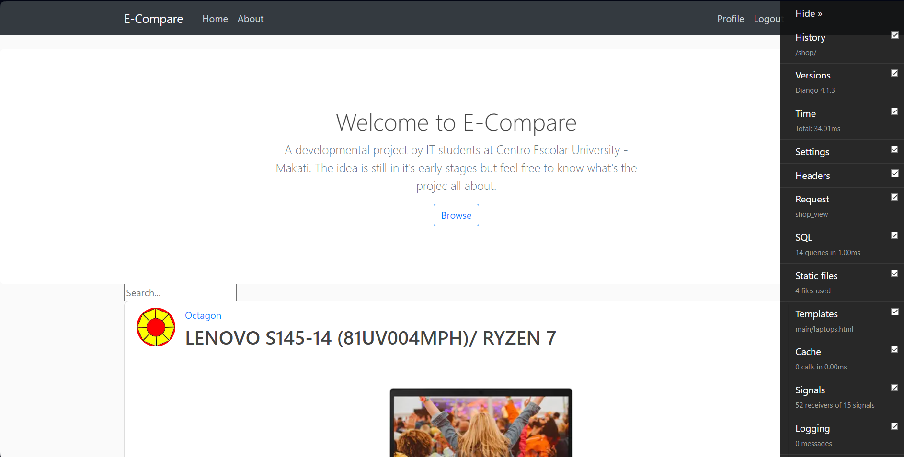
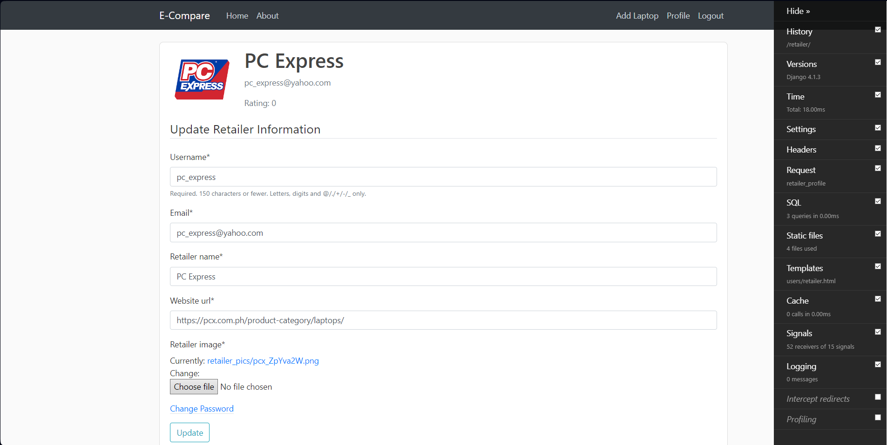

<a name="readme-top"></a>


<!-- TABLE OF CONTENTS -->
<details>
  <summary>Table of Contents</summary>
  <ol>
    <li>
      <a href="#about-the-project">About The Project</a>
      <ul>
        <li><a href="#built-with">Built With</a></li>
      </ul>
    </li>
    <li>
      <a href="#getting-started">Getting Started</a>
      <ul>
        <li><a href="#prerequisites">Prerequisites</a></li>
        <li><a href="#installation">Installation</a></li>
      </ul>
    </li>
       <li>
      <a href="#api-routes">Routes</a>
      <ul>
           <li><a href="#api-routes">API Routes</a></li>
           <li><a href="#front-end-routes">Front-end Routes</a></li>
      </ul>
    </li>
    <li><a href="#roadmap">Roadmap</a></li>
    <li><a href="#contributing">Contributing</a></li>

  </ol>
</details>


<h1 align="center">E-Compare</h1>

A platform for consumers and retailers for getting, and offering the beast deals. A web app where you can buy laptops at a comptetive price, see what other laptop retailers offering for the same product. 
_____________________________________________________________________________________________________

<!-- ABOUT THE PROJECT -->
## About The Project





Features:
* Helpful error messages when a bad request happens.
* Scaleable to a complete system
* Uses JWT in making requests to the backend


<p align="right">(<a href="#readme-top">back to top</a>)</p>


### Built With


* [![Python][Python.org]][Python-url]
* [![Django Restframework][Django-rest-framework.org]][Drf-url]
* [![SQLite][Sqlite.org]][Sqlite-url]
* [![Bootstrap][Bootstrap.com]][Bootstrap-url]
* [![JQuery][JQuery.com]][JQuery-url] 

<p align="right">(<a href="#readme-top">back to top</a>)</p>


<!-- GETTING STARTED -->
## Getting Started

Download all the prerequisites below in order.

### Prerequisites
Download all of these to get started

* [Python](https://www/python.org)
* [Django](https://www.djangoproject.com)
* [Django Restframework](https://www.django-rest-framework.org)
* [Simple JWT](https://django-rest-framework-simplejwt.readthedocs.io/en/latest/) 

### Installation

_Once installed, open a command prompt, choose your directory wherein you want to save the project. Finally, clone the repo._


1. Clone the repo
   ```sh
   C:\Users\PC> git clone https://github.com/neekho/ECompare.git
   ```
2. Go to the project folder
   ```sh
   C:\Users\PC> cd ECompare
   ```
3. Create a superuser _Provide the neccessary information when prompt._
   ```sh
   C:\Users\PC\ceu> python manage.py createsuperuser
   ```
   
4. Run the local server either specify a port number or use the default (8000)
   ```sh
    C:\Users\PC\ceu> python manage.py runserver <OPTIONAL: PORTNUMBER>
   ```

_Once the local surver is running, open up a browser and go to http://localhost:8000/overview._


<p align="right">(<a href="#readme-top">back to top</a>)</p>

___________________________________________________________________________________________________


### Front-end Routes

<h3>Users</h3>

Please keep in mind, clicking on the link does not open a new tab in whatever web browser you are using, GitHub doesn't support using HTML within Markdown directly, including the {target="_blank"} attribute for links. GitHub sanitizes HTML for security reasons.

All routes listed below are for both users and retailers.

* [Register](http://localhost:8000/register) _Register first before you can access the main page._
* [Login](http://localhost:8000/) _A login promp will be displayed, enter your credentials._
* [Logout](http://localhost:8000/logout) _If logged in, your account will be signed out._
* [Profile](http://localhost:8000/profile)  _Displays user content._
* [Change Password](http://localhost:8000/password  ) _Change or update your password._

<h3>Shop</h3>
Users and retailers will be able to access these routes.

* [Shop](http://localhost:8000/shop) _Displays all existing products within the application_
* [Compare](http://localhost:8000/compare) _Compare two existing products_
* [Retailer Profile](http://localhost:8000/retailer/<str:name>) _Displays all existing products within the application_
* [Product by ID](http://localhost:8000/laptop/1/) _- http://localhost:8000/<str:pk>/ Displays a single page for a product_


<h3>Retailer</h3>
You must be logged in as a retailer, to have the priveleges listed below.

* [Product Creation](http://localhost:8000/manage/new) _Create a product._
* [Product Update](http://localhost:8000/laptop/1/update/) _- http://localhost:8000/<str:pk>/ For updating the provided product id_
* [Product Archive](http://localhost:8000/laptop/1/delete/) _- http://localhost:8000/<str:pk>/ For archiving a product with the supplied id_


<h3>Misc</h3>

* [About](http://localhost:8000/about/) _Commendation of insturctors_


<p align="right">(<a href="#readme-top">back to top</a>)</p>


___________________________________________________________________________________________________


<!-- ROADMAP -->
## Roadmap

- [ ] Deployment
- [ ] Modeling 
- [ ] Card UI in home page


<p align="right">(<a href="#readme-top">back to top</a>)</p>

___________________________________________________________________________________________________

<!-- CONTRIBUTING -->
## Contributing

Contributions are what make the open source community such an amazing place to learn, and create. Any contributions you make are **greatly appreciated**.

If you have a suggestion that would make this better, please fork the repo and create a pull request. You can also simply open an issue with the tag "enhancement".
Don't forget to give the project a star! Thanks again!

1. Fork the Project
2. Create your Feature Branch (`git checkout -b feature/AmazingFeature`)
3. Commit your Changes (`git commit -m 'Add some AmazingFeature'`)
4. Push to the Branch (`git push origin feature/AmazingFeature`)
5. Open a Pull Request

<p align="right">(<a href="#readme-top">back to top</a>)</p>


<!-- MARKDOWN LINKS & IMAGES -->
<!-- https://www.markdownguide.org/basic-syntax/#reference-style-links -->
[product-screenshot]: images/screenshot.png

[Python.org]: https://img.shields.io/badge/Python-35495E?style=for-the-badge&logo=python&logoColor=white
[Python-url]: https://python.org/

[Django-rest-framework.org]: https://img.shields.io/badge/DjangoRestframework-33415E?style=for-the-badge&logo=python&logoColor=white
[Drf-url]: https://www.django-rest-framework.org


[Sqlite.org]: https://img.shields.io/badge/SQLite-6d93d1?style=for-the-badge&logo=SQLite&logoColor=white
[Sqlite-url]: https://www.sqlite.org/index.html


[Bootstrap.com]: https://img.shields.io/badge/Bootstrap-563D7C?style=for-the-badge&logo=bootstrap&logoColor=white
[Bootstrap-url]: https://getbootstrap.com
[JQuery.com]: https://img.shields.io/badge/jQuery-0769AD?style=for-the-badge&logo=jquery&logoColor=white
[JQuery-url]: https://jquery.com 
